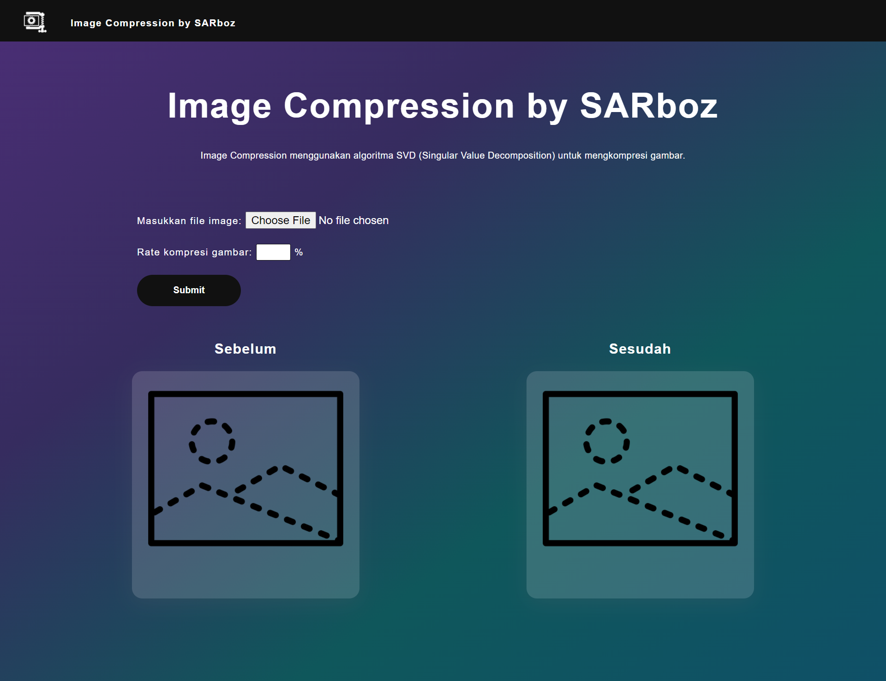
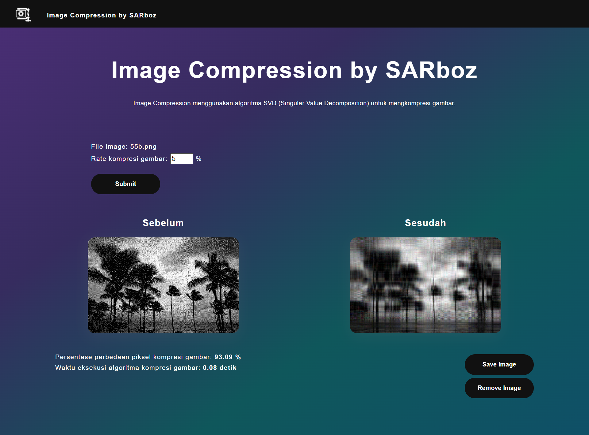

# Algeo02-20065
Website for image compression using SVD (Singular Value Decomposition) algorithm.

## Table of Contents
[General Information](#general-information)
[Technologies Used](#technologies-used)
[Features](#features)
[Structures](#structures)
[Setup](#setup)
[Usage](#usage)

## General Information
Image compression is a type of data compression that applied to digital image. Using image compression, we can reduce the file size of an image to significant levels without decreasing the quality of the image itself. There are numerous algorithm that are used for image compression, for example SVD (Singular Value Decomposition), DCT (Discrete Cosine Transform), and LZW (Lempel–Ziv–Welch). In this case, we used SVD for the algorithm that we used in this program.
SVD is a method for factoring matrix into three submatrix (orthogonal matrix U, diagonal matrix Σ, and transpose of orthogonal matrix V). The method in SVD itself is a generalization from eigendecomposition of a square matrix.

## Technologies Used
* Flask - version 2.0.2
* opencv - version 4.5.48
* Pillow - 8.4.0

## Features
* Image compression with user input compression percentage
* Compressed image preview
* Lossless image saving

## Screenshots

<center>Tampilan Front Page</center>

<center>Tampilan View Page</center>

## Structures
```bash
.
│   README.md
│   requirement.txt
│   
└───Website
    │   app.py
    │   Eigen.py
    │   SVD.py
    │
    ├───static
    │   ├───images
    │   │       imageNotAvailable.png
    │   │       logo.png
    │   │       logoSmall.png
    │   │
    │   └───styles
    │           frontpage.css
    │
    └───templates
            frontpage.html
```

## Setup
1. Go to Website folder.
2. Create new virtual environment in that folder using `virtualenv venv`.
3. Activate aforementioned environment using `venv/bin/activate` on Linux/OS X and `venv\scripts\activate` on Windows.
4. Install all dependencies using `pip install -r requirements.txt`.

## Usage
1. Run `App.py` from text editor.
2. Open `127.0.0.1:5000` localhost from your browser.
3. Upload and compress your image from the webpage.
4. Close terminal to quit from program.